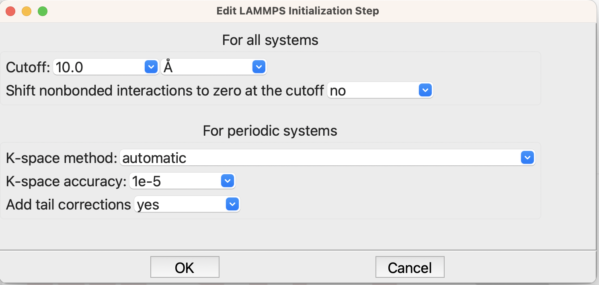
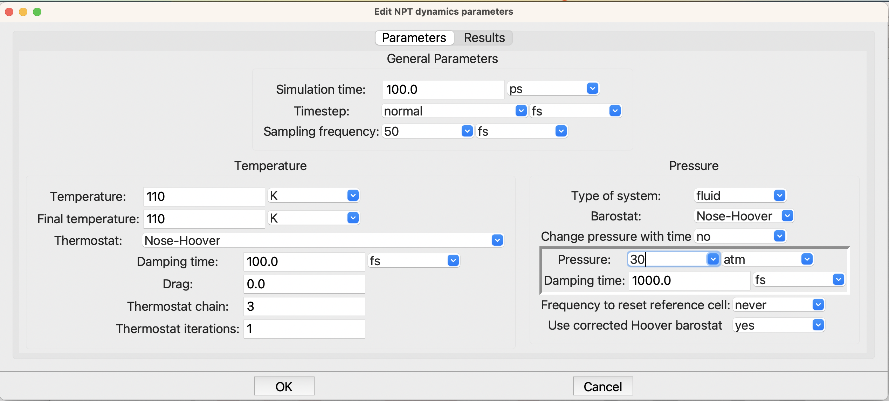
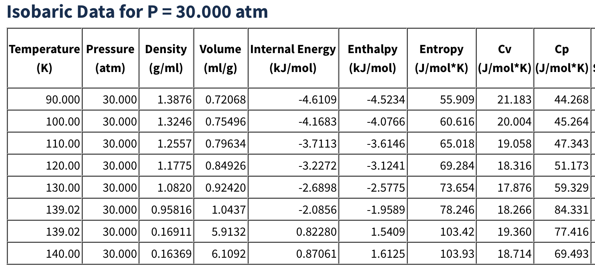

***************
Getting Started
***************

Installation
============
The LAMMPS step is probably already installed in your SEAMM environment, but
if not or if you wish to check, follow the directions for the `SEAMM Installer`_. The
graphical installer is the easiest to use. In the SEAMM conda environment, simply type::

  seamm-installer

or use the shortcut if you installed one. Switch to the second tab, `Components`, and
check for `LAMMPS-step`. If it is not installed, or can be updated, check the box
next to it and click `Install selected` or `Update selected` as appropriate.

The non-graphical installer is also straightforward::

  seamm-installer install --update lammps-step

will ensure both that it is installed and up-to-date.

.. _SEAMM Installer: https://molssi-seamm.github.io/installation/index.html

Example of NPT dynamics
=======================
Here is a simple example that will run quickly on any machine, including your
laptop. We'll simulate an argon fluid at 110 K and 30 atm pressure using a periodic cell
containing 1000 atoms.

First we need a :download:`flowchart <./ar_npt_dynamics.flow>` for the simulation. It
needs to have three steps:

.. figure:: flowchart.png
   :width: 300px
   :align: center
   :alt: Flowchart for Ar fluid simulation

   Flowchart for Ar fluid NPT simulation

Create a flowchart that looks like the above. If you need help doing this, please go to
the main `SEAMM tutorials`_, then come back here once you are more familiar with the
interface. We'll edit each step in the next paragraphs, so just create a flowchart that
looks like the above.

The three steps are straightforward: the first establishes the forcefield that will be
used in all subsequent steps unless charge by another Forcefield Step; the Packmol step
will create the fluid system of argon; and the LAMMPS step, run the molecular dynamics.

Now edit the forcefield step and set the forcefield to OPLS-AA, like this:

.. figure:: edit_forcefield.png
   :width: 600px
   :align: center
   :alt: Setting the forcefield

   Setting the forcefield for the simulation

You will need to change the forcefield repository to `oplsaa.frc`. Each forcefield may
have different variants in the file; however, for this calculation the default is all we
need.

Next edit the `Packmol Step` and set it up as shown:

.. figure:: edit_packmol.png
   :width: 600px
   :align: center
   :alt: Building the Ar fluid system

   Building the Ar fluid system

Here you will need to change to a periodic system. Check that Packmol will build a cubic
system with a density of 0.7. Set the approximate number of atoms to 1000 -- that will
be the number of argon atoms in your simulation box. If you wish you can change the
system and configuration names, but they will not be used anywhere else in this example,
so you can leave them with the defaults, if you wish.

The last step is to create the LAMMPS simulation. When you edit the `LAMMPS Step` you
will see a dialog for creating a flowchart that is similar to the main one that you just
created. However, the choice of steps on the left is specific to LAMMPS. Create a LAMMPS
flowchart like this:

.. figure:: lammps_flowchart.png
   :width: 300px
   :align: center
   :alt: Subflowchart for LAMMPS

   Subflowchart for LAMMPS

Now edit the steps. There is actually nothing that you need to change in the
`Initialization Step`. The defaults are usually fine:

   The LAMMPS initialization step

There is more needed in the NPT dynamics step:

   The LAMMPS NPT step

Here you need to change the two temperatures on the left side to 110 K and the pressure,
on the right, to 30 atm. This is in the liquid part of the phase diagram for argon, as
we can see at the nice `NIST fluid properties`_ website:

   Tabulation of Argon fluid properties at NIST
   
Experimentally the density should be about 1.256 at the temperature and pressure that we
have chosen. Let's see what we get! Submit the calculation to your Dashboard and check
the results. It will take about a minute to run. You should then find something similar
to this in `job.out`::

  Step 3: LAMMPS  2022.10.31+4.g1c55ce2.dirty
   LAMMPS using the serial version.

   Step 3.2: NPT dynamics
       100.0 ps of canonical (NPT) dynamics at 110.0 K using a Nose-Hoover
       thermostat. The thermostat will use a chain of 3 thermostats with 1
       subcycles and a drag factor of 0.0.

 
       The run will be 50,000 steps of dynamics sampled every 25 steps.
 
       Analysis of trajectory_npt_3_2.seamm_trj

                                             Std Error  Time to
               Property           Value       of mean   convergence     tau    inefficiency
          --------------------   ---------  ---------   -----------  --------  ------------
                             T =   110.568 ±   0.595      0.00 fs     25.0 fs        2.0
                             P =    68.086 ±  39.845      0.00 fs     25.0 fs        1.2
                       density =     1.253 ±   0.001*     9.00 ps    546.3 fs       22.9
                             a =    37.547 ±   0.014*     9.00 ps    547.1 fs       22.9
                             b =    37.547 ±   0.014*     9.00 ps    547.1 fs       22.9
                             c =    37.547 ±   0.014*     9.00 ps    547.1 fs       22.9
                          Etot =  -687.190 ± 178.422      0.00 fs    400.8 fs       17.0
                           Eke =   329.250 ±   1.771      0.00 fs     25.0 fs        2.0
                           Epe = -1029.024 ± 163.311      0.00 fs    358.3 fs       15.3
                         Epair = -1029.024 ± 163.311      0.00 fs    358.3 fs       15.3

  Wrote the final structure to 'final_structure.mmcif' and 'final_structure.cif' for viewing.

The density predicted -- third line in the table -- is 1.253, very close to the
experimental value of 1.256. Of course, Argon is about the easiest possible case!
However, you should expect fluid densities within 1-2% with a good forcefield.

If you open the folder labeled '3' on the left of the Dashboard, you will find a
collection of graphs listed. The last one is the density. If you click on it you will
see a graph like the following:

.. figure:: density.png
   :width: 800px
   :align: center
   :alt: The plot of the density vs time in the simulation

   The density of the Argon during the simulation

The subgraph on the left shows the density vs time as a green line. It started at a low
value of 0.7 because we asked Packmol to create a system with that density. Initially it
actually dropped lower because some atoms in the as-built structure were too close
together and pushed everything apart. Then the pressure rapidly climbs to about 1.25
after 10 ps, and then fluctuates around that value for the rest of the run. SEAMM
automatically determines when the property has settled down and computes the average and
standard error that you saw in the table above. It is also indicated by the black
horizontal line in the graph.

The graph on the right shows the autocorrelation function and an exponential fit to it,
which is used to get the time constant of the autocorrelation. In this case the time
constant is about 500 fs, or 0.5 ps. This means that the density at a time t is still
correlated with the density 0.5 ps earlier, meaning that there is little new information
gained by sampling that density. This is the basis of the statistical inefficiency in
the table, which was about 23 for the density. In this calculation we sampled the
properties every 50 ps, which was fine for the pressure, for example, but is about 23
times more often than useful for the density. The results shown are correct because the code
corrects for the oversampling. It just means that the trajectory file is about 23 times
larger than it needs to be and the code did some more work than necessary to correctly
predict the density and its standard error.

That should be enough to get started. For more detail about the functionality in this
plug-in, see the :ref:`User Guide <user-guide>`.

.. _SEAMM tutorials: https://molssi-seamm.github.io/getting_started/index.html
.. _NIST fluid properties: https://webbook.nist.gov/cgi/fluid.cgi?P=30&TLow=90&THigh=140&TInc=10&Digits=5&ID=C7440371&Action=Load&Type=IsoBar&TUnit=K&PUnit=atm&DUnit=g%2Fml&HUnit=kJ%2Fmol&WUnit=m%2Fs&VisUnit=uPa*s&STUnit=N%2Fm&RefState=DEF
